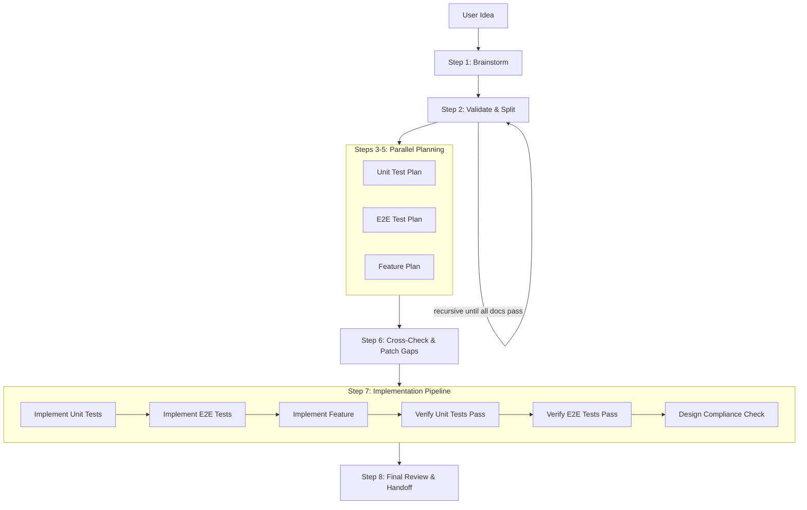

# Design-to-Deploy Pipeline

A recursive, multi-agent workflow skill for Claude Code that automates the journey from idea to validated design to implementation to verified tests.

## Core Principle: Context Isolation

Each major step spawns a new agent instance with:

- Fresh context (no accumulated noise)
- Specific input files (design docs, plans)
- Clear output requirements
- Session artifacts passed via filesystem, not context

## Pipeline Architecture



## Usage

```bash
# In Claude Code
/design-to-deploy "Add user authentication with magic links"
```

## Sub-Skills

| Sub-Skill | Input | Output |
|-----------|-------|--------|
| `brainstormer` | User idea + project context | design-doc.md |
| `scope-validator` | design-doc.md | validated doc(s) or split docs |
| `unit-test-planner` | design-doc.md | unit-test-plan.md |
| `e2e-test-planner` | design-doc.md | e2e-test-plan.md |
| `feature-planner` | design-doc.md | feature-plan.md |
| `plan-reviewer` | All 3 plans + design doc | Patched plans |
| `test-implementer` | test-plan.md | Test files |
| `playwright-implementer` | e2e-plan.md | Playwright test files |
| `feature-implementer` | feature-plan.md | Feature code |
| `test-verifier` | Test files + code | Pass/fail + fixes |
| `e2e-verifier` | Playwright tests | Pass/fail + screenshots |
| `design-compliance-checker` | Design doc + all code | Compliance report |
| `review-compiler` | All artifacts | Human handoff notes |

## Git Worktree Strategy

The entire pipeline runs in a git worktree to keep the main branch clean:

```bash
# At pipeline start
git worktree add ../worktrees/{session-id} -b feature/{topic}

# All implementation happens in worktree
cd ../worktrees/{session-id}

# On successful completion - merge and cleanup
git checkout main
git merge feature/{topic}
git worktree remove ../worktrees/{session-id}

# On failure - worktree preserved for human review
```

## Failure Handling

When test verification fails:

1. **Attempts 1-2**: Fix in current context
2. **Attempt 3**: Invoke `systematic-debugging` sub-skill
3. **Attempt 4+**: **STOP pipeline**, generate failure report, await human intervention

## Commit Strategy

Commits after each successful step for clear rollback points:

```
design({topic}): brainstorm complete
design({topic}): scope validated
plan({topic}): all plans generated
test({topic}): unit tests implemented (failing)
test({topic}): e2e tests implemented (failing)
feat({topic}): feature implemented
test({topic}): unit tests passing
test({topic}): e2e tests passing
verify({topic}): design compliance confirmed
```

## Session History

All artifacts are preserved in `session-history/`:

```
session-history/YYYY-MM-DD-HH-MM-{topic}/
├── 00-brainstorm-transcript.md
├── 01-design-doc.md
├── 02-scope-validation.md
├── 03-unit-test-plan.md
├── 04-e2e-test-plan.md
├── 05-feature-plan.md
├── 06-cross-check-report.md
├── 07-implementation-log.md
├── 08-test-results/
│   ├── unit-test-output.txt
│   ├── e2e-test-output.txt
│   └── screenshots/
├── 09-design-compliance.md
└── 10-review-notes.md
```

## Configuration

Create `.design-to-deploy.yml` in your project root:

```yaml
testing:
  unit:
    framework: vitest
    config: vitest.config.ts
    command: "npx vitest run"
  e2e:
    framework: playwright
    config: playwright.config.ts
    command: "npx playwright test"
    screenshot_dir: "e2e/screenshots"

paths:
  designs: "docs/designs"
  plans: "docs/plans"
  session_history: "session-history"

validation:
  max_files_to_create: 10
  max_implementation_hours: 4
  require_scope_declaration: true
```

## Scope Validation

Design docs should include a scope declaration:

```markdown
## Scope Declaration

- Type: [atomic-feature | multi-feature | epic]
- Estimated Complexity: [small | medium | large]
- Dependencies: [list of external dependencies]
- Can Be Split: [yes | no]
```

Designs are flagged for splitting when they exceed thresholds:
- More than 10 files to create
- More than 15 files to modify
- More than 3 distinct feature areas
- More than 2 external API integrations
- More than 3 new database tables

## External Skill Dependencies

| Skill | Purpose | Trigger |
|-------|---------|---------|
| `brainstorming` | Entry point - refines ideas into design docs | Step 1 |
| `systematic-debugging` | Root cause analysis when fixes fail | After 2 failed fix attempts |

## License

See [LICENSE](LICENSE) for details.
