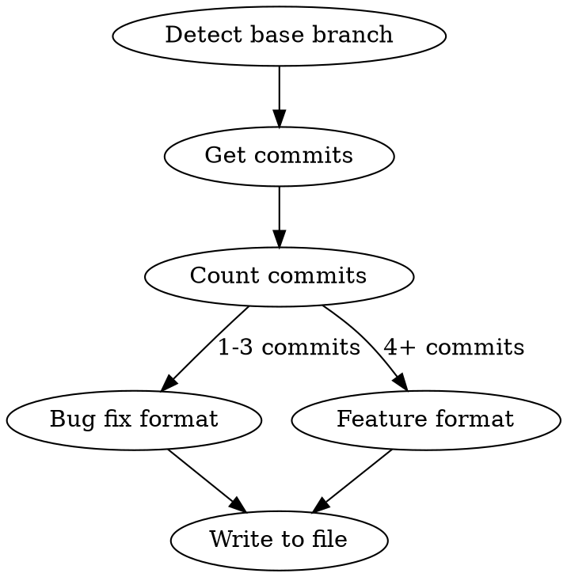

# Changelog

Generate a concise changelog from git commits on the current branch.

**Core principle:** Length proportional to scope. Bug fix = paragraph. Feature = sectioned bullets. Never verbose, never skeletal.

## Process



### Step 1: Detect Base Branch and Ticket

```bash
# Extract ticket ID from branch name (e.g., feature/PROJ-123-add-auth -> PROJ-123)
BRANCH=$(git branch --show-current)
# Find the closest remote branch by commit distance (fewest commits ahead = true base)
for branch in $(git branch -r | grep -v HEAD); do
count=$(git log --oneline "$branch"..HEAD 2>/dev/null | wc -l)
echo "$count $branch"
done | sort -n | head -5
```

Pick the closest branch (lowest non-zero commit count, excluding the current branch's own remote). In repos with chained task branches (e.g., PROJ-10 → PROJ-11 → PROJ-12), the parent task branch is the correct base — not `main` or `develop`.

If the result is ambiguous (multiple branches at the same distance), ask: "This branch looks closest to `<branch>` — is that correct?"

Extract the ticket ID from the branch name. If no ticket ID is found, ask the user.

### Step 2: Gather Commits

```bash
git log --oneline BASE_BRANCH..HEAD
```

**Merge-heavy branches:** If the commit list returns a large number of commits (50+) from many merged branches, you likely have the wrong base branch — go back to Step 1 and find a closer one. If no closer branch exists, scope the changelog to the ticket in the branch name:

```bash
# Filter commits relevant to the ticket
git log --oneline BASE_BRANCH..HEAD | grep -i "TICKET-ID"
# Also check non-merge commits by the author for unlabelled work
git log --oneline BASE_BRANCH..HEAD --no-merges --author="$(git config user.name)"
```

Use commit messages and the filtered diff to identify which changes belong to this ticket. Ignore commits from other merged branches.

### Step 3: Generate Changelog

**Read the actual code changes** (`git diff BASE_BRANCH..HEAD`) to understand what changed. Don't rely solely on commit messages — they may be vague or misleading. For merge-heavy branches, scope the diff to relevant directories rather than the entire branch.

#### Bug Fix Format (1-3 commits)

```markdown
# TICKET-ID: Brief description of the fix

## Bug Fix

One paragraph: what was broken, why, and what the fix does.
```

Example:

```markdown
# PROJ-42: Fix stale cache after profile update

## Bug Fix

Updating a user profile no longer serves stale data. The cache key was not
invalidated after a write; it now clears the relevant cache entry on save.
```

#### Feature Format (4+ commits)

```markdown
# TICKET-ID: Brief feature description

## Changes

### Added
- Feature or component name — what it does and why

### Changed
- What was modified — brief explanation of the change

### Fixed
- What was broken — how it's now resolved
```

Only include sections that apply.

**Bullet formatting:**
- Keep each top-level bullet short — a brief name or summary
- If a bullet needs more detail, use a sub-list instead of a long line
- Sub-list items should be short phrases, not full sentences

Example:

```markdown
### Added
- Two-factor authentication for user login
- TOTP setup wizard with QR code and backup codes
- Verification middleware for protected routes
- Account recovery flow via email confirmation

### Changed
- Session tokens now include 2FA status claim
```

### Step 4: Write to File

Write the changelog to a markdown file for easy copying:

```
docs/changelog-TICKET-ID.md
```

## Hard Rules

| Rule | Reason |
|------|--------|
| No git hashes | Noise — not useful in changelogs |
| No file path lists | Too verbose — describe changes by feature, not by file |
| No narrative prose sections | No "Problem / Root Cause / Fix" — just state what changed |
| No tables, file trees, or code blocks in the changelog itself | Keep it scannable |
| Bullets describe what + why | "Added retry logic for transient S3 failures" not "Modified S3Client.php" |

## Scaling Guide

| Scope | Commits | Format | Typical length |
|-------|---------|--------|----------------|
| Bug fix | 1-3 | Title + paragraph | 5-10 lines |
| Small feature | 4-6 | Added/Changed/Fixed bullets | 15-25 lines |
| Large feature | 7+ | Summary line + sectioned bullets | 30-60 lines |

If the output exceeds ~60 lines, you're being too verbose. Consolidate related bullets.

## Common Mistakes

- **Repeating commit messages verbatim** — Commits are implementation notes; changelogs describe outcomes
- **One bullet per commit** — Group by feature/area, not by commit
- **Including "Files Changed" sections** — Describe features, not files
- **Adding migration guides or deployment notes** — Those belong in separate docs unless explicitly requested
