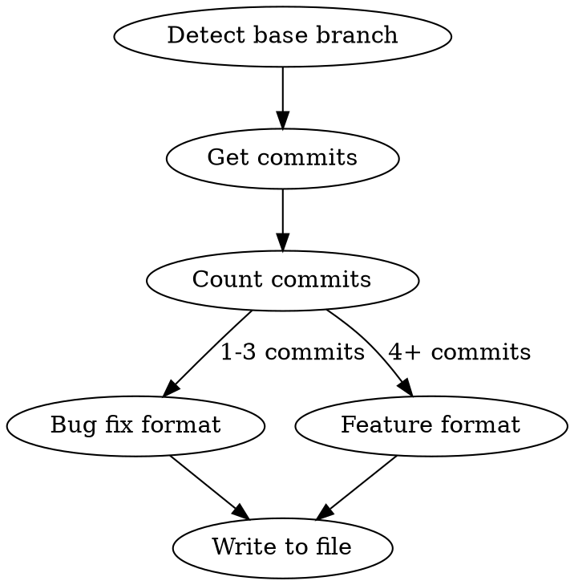

# Changelog

Generate a concise changelog from git commits on the current branch.

**Core principle:** Length proportional to scope. Bug fix = paragraph. Feature = sectioned bullets. Never verbose, never skeletal.

## Process



### Step 1: Detect Base Branch and Ticket

```bash
# Extract ticket ID from branch name (e.g., task/IODR-361-description -> IODR-361)
BRANCH=$(git branch --show-current)
# Find base branch - try main first, then master, then develop
git merge-base HEAD main 2>/dev/null || git merge-base HEAD master 2>/dev/null
```

If the base branch is ambiguous, ask: "This branch split from `main` — is that correct?"

Extract the ticket ID from the branch name. If no ticket ID is found, ask the user.

### Step 2: Gather Commits

```bash
git log --oneline main..HEAD    # adjust base branch as needed
```

**Merge-heavy branches:** If `main..HEAD` returns a large number of commits (50+) from many merged branches, scope the changelog to the ticket in the branch name:

```bash
# Filter commits relevant to the ticket
git log --oneline main..HEAD | grep -i "TICKET-ID"
# Also check non-merge commits by the author for unlabelled work
git log --oneline main..HEAD --no-merges --author="$(git config user.name)"
```

Use commit messages and the filtered diff to identify which changes belong to this ticket. Ignore commits from other merged branches.

### Step 3: Generate Changelog

**Read the actual code changes** (`git diff main..HEAD`) to understand what changed. Don't rely solely on commit messages — they may be vague or misleading. For merge-heavy branches, scope the diff to relevant directories rather than the entire branch.

#### Bug Fix Format (1-3 commits)

```markdown
# TICKET-ID: Brief description of the fix

## Bug Fix

One paragraph: what was broken, why, and what the fix does.
```

Example (accepted in IODR-350):

```markdown
# IODR-350: Path does not update when modifier is removed in Path Mapper

## Bug Fix

Clearing a modifier in the Debug Path Mapper no longer leaves the old modifier
suffix on the path. Previously the `afterStateUpdated` callback returned early
on empty state; it now strips the modifier suffix from the path.
```

#### Feature Format (4+ commits)

```markdown
# TICKET-ID: Brief feature description

## Changes

### Added
- Feature or component name — what it does and why

### Changed
- What was modified — brief explanation of the change

### Fixed
- What was broken — how it's now resolved
```

Only include sections that apply.

**Bullet formatting:**
- Keep each top-level bullet short — a brief name or summary
- If a bullet needs more detail, use a sub-list instead of a long line
- Sub-list items should be short phrases, not full sentences

Example (accepted in IODR-361):

```markdown
### Added
- Update Phone Number action on the user view page
- Two-step wizard: validate E.164 format, send OTP via Twilio, save after verification
- Remove Phone Number action with confirmation dialog
- User resource for Filament admin panel
- List, view, and edit pages with phone number in infolist and table columns
- Matters relation manager on the user view page

### Changed
- OTP frontend functions split into separate `sendOtp.ts` and `verifyOtp.ts` modules
```

### Step 4: Write to File

Write the changelog to a markdown file for easy copying:

```
docs/changelog-TICKET-ID.md
```

## Hard Rules

| Rule | Reason |
|------|--------|
| No git hashes | Noise — not useful in changelogs |
| No file path lists | Too verbose — describe changes by feature, not by file |
| No narrative prose sections | No "Problem / Root Cause / Fix" — just state what changed |
| No tables, file trees, or code blocks in the changelog itself | Keep it scannable |
| Bullets describe what + why | "Added retry logic for transient S3 failures" not "Modified S3Client.php" |

## Scaling Guide

| Scope | Commits | Format | Typical length |
|-------|---------|--------|----------------|
| Bug fix | 1-3 | Title + paragraph | 5-10 lines |
| Small feature | 4-6 | Added/Changed/Fixed bullets | 15-25 lines |
| Large feature | 7+ | Summary line + sectioned bullets | 30-60 lines |

If the output exceeds ~60 lines, you're being too verbose. Consolidate related bullets.

## Common Mistakes

- **Repeating commit messages verbatim** — Commits are implementation notes; changelogs describe outcomes
- **One bullet per commit** — Group by feature/area, not by commit
- **Including "Files Changed" sections** — Describe features, not files
- **Adding migration guides or deployment notes** — Those belong in separate docs unless explicitly requested
