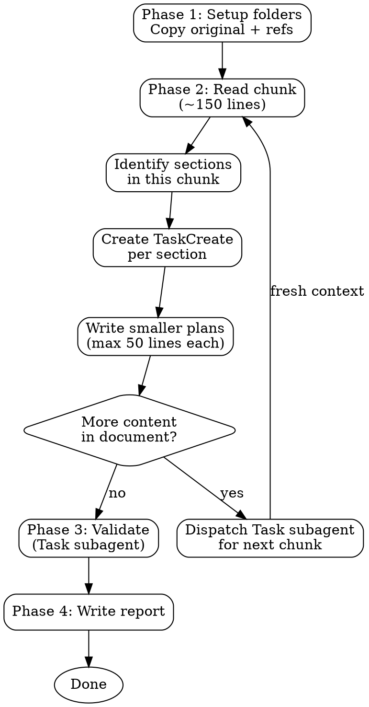

# Dissect Plan

## Overview

Break a large plan document into small, self-contained plan files (max 50 lines each) that an agent can execute independently from start to finish. Creates a structured folder with dependency tracking, cross-referenced documents, and validation.

**Announce at start:** "I'm using the dissect-plan skill to break this document into agent-executable chunks."

**Invocation:** `/dissect-plan @path/to/plan.md`

The `@` argument is the source document to dissect. If no argument is provided, ask the user which document to dissect.

## The Process



### Phase 1: Setup

1. Create `plan-pit/` at the project root if it doesn't exist
2. Derive a folder name from the input file (strip date prefix and extension, use kebab-case)
   - Example: `2026-02-13-class-abilities-design.md` → `class-abilities-design`
3. Create `plan-pit/{folder-name}/`
4. Copy the original plan into `plan-pit/{folder-name}/original.md`
5. Scan the plan for references to other documents (relative paths, `@` links, "see X" references)
6. Copy referenced documents into `plan-pit/{folder-name}/refs/`

### Phase 2: Dissection (top-to-bottom, sequential)

**CRITICAL:** Process the document from top to bottom. Do NOT attempt to dissect the entire plan in one pass.

1. Read the plan and identify logical sections (headings, phases, features, distinct topics)
2. For each section, use `TaskCreate` to track the dissection work
3. Work through tasks sequentially, writing one smaller plan file per section
4. **Context management:** If the original document exceeds ~200 lines, dispatch a `Task` subagent for each subsequent chunk (~150 lines) so each gets fresh context. Pass the starting line offset and folder path.

**Smaller plan file rules:**

| Rule | Detail |
|------|--------|
| **Max length** | 50 lines. If a section is too big, split it into multiple plans |
| **Self-contained** | An agent must be able to execute it without reading the original |
| **Context included** | Copy relevant WHY explanations, design decisions, and constraints from the original |
| **Acceptance criteria** | Include definition of done or success criteria where possible |
| **No spoilers** | Don't reference "see original" — include everything needed inline |

**File naming:** `{NNN}-{max-3-word-title}-{YYYYMMDD}.md`

- `NNN`: Zero-padded sequential number (001, 002, 003...)
- Title: Max 3 words, kebab-case, describes the deliverable
- Date: `YYYYMMDD` format of creation date
- Examples: `001-stat-scaling-20260214.md`, `002-adventurer-abilities-20260214.md`

**Dependency frontmatter:** If a plan requires work from another plan to be completed first, declare it:

```yaml
---
depends-on: 001-stat-scaling-20260214.md
---
```

For multiple dependencies, use an array:

```yaml
---
depends-on:
  - 001-stat-scaling-20260214.md
  - 003-upgrade-formula-20260214.md
---
```

If a plan has no dependencies, omit the frontmatter entirely.

**Informational sections:** Not every heading in the original needs its own plan file. Reference sections, synergy descriptions, and open questions that aren't directly implementable should be distributed as context into the relevant plan files rather than getting their own file. Only create plan files for actionable, implementable sections.

### Phase 3: Validation

After ALL smaller plans are written, dispatch a `Task` subagent with this prompt structure:

> You are validating a plan dissection. Read the original plan at `plan-pit/{folder}/original.md` and ALL numbered plan files in `plan-pit/{folder}/`. Cross-check against these criteria:
>
> 1. **Completeness** — Every section of the original is covered by at least one smaller plan
> 2. **Information preservation** — No context, decisions, requirements, or constraints were lost
> 3. **Dependency accuracy** — All `depends-on` references point to real files, no circular dependencies
> 4. **Cohesion** — Executing all plans in numbered order (respecting dependencies) achieves the original plan's goals
> 5. **Self-containment** — Each plan can be understood and executed without reading the original or other plans (except declared dependencies)
>
> For each criterion, mark every plan file as SUCCESS, WARN, or FAULT with a one-line explanation.

### Phase 4: Report

The validator writes its report to `plan-pit/{folder-name}/reports/`.

**Report filename:** `success{N}-warn{N}-fault{N}-report.md` where N is the count of each finding type.

Example: `success8-warn2-fault0-report.md`

**Report format:**

```markdown
# Dissection Validation Report

**Original:** {filename}
**Plans created:** {count}
**Date:** {YYYY-MM-DD}

## Successes ({count})
- [x] 001-stat-scaling: Complete, self-contained, includes all stat tables from original

## Warnings ({count})
- [!] 003-rogue-abilities: Missing flanking bonus context from Design Principles section

## Faults ({count})
- [ ] 005-status-effects: Depends on 004 but doesn't declare it in frontmatter
```

## Folder Structure

After dissection, the folder looks like this:

```
plan-pit/
└── class-abilities-design/
    ├── original.md                          # Unmodified copy of source
    ├── refs/                                # Referenced documents (if any)
    │   └── class-potentials-design.md
    ├── 001-design-principles-20260214.md    # Smaller plans
    ├── 002-stat-scaling-20260214.md
    ├── 003-adventurer-abilities-20260214.md
    ├── 004-rogue-abilities-20260214.md
    ├── ...
    └── reports/
        └── success8-warn1-fault0-report.md  # Validation report
```

## Common Mistakes

| Mistake | Fix |
|---------|-----|
| One-shotting the entire plan | Process top-to-bottom, section by section. Use TaskCreate to track each. |
| Plans that say "see original for details" | Each plan must inline all necessary context. No back-references. |
| Plans exceeding 50 lines | Split further. A plan should be one focused deliverable. |
| Missing dependency declarations | Check if a plan assumes work from another plan exists first. |
| Losing decision rationale | Copy WHY explanations from the original into relevant smaller plans. |
| Generic 3-word titles | Use specific titles that describe the deliverable, not the section heading. |
| Skipping the validation step | Always run the validator subagent. Gaps are invisible to the dissector. |
| Creating plans for non-actionable sections | Distribute informational/reference content into relevant plans. |
| Numbering gaps after splits | Re-number to keep sequence clean (001, 002, 003...). |
