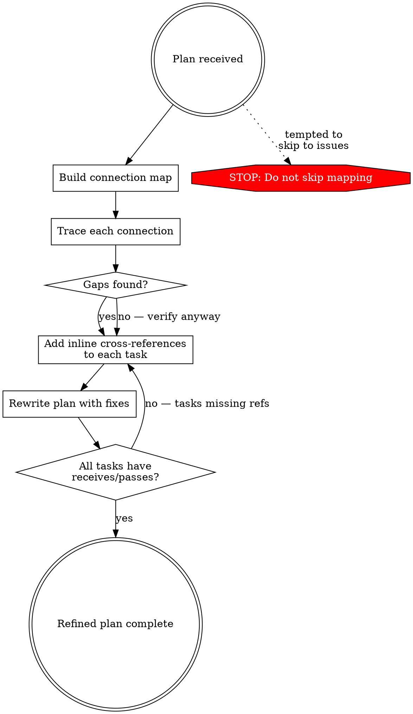

# Refining Plans

## Overview

Refine an existing plan by mapping how its parts connect, exposing gaps in those connections, and rewriting the plan with fixes. **Connection mapping comes first — before any issue-finding.**

Without a connection map, reviewers find surface issues but miss structural disconnects. Baseline testing showed agents consistently miss 60-75% of plan gaps when they skip mapping.

## When to Use

- You have an existing plan that needs review before execution
- Tasks in a plan seem to reference each other implicitly but connections aren't explicit
- You need to identify what's missing, misordered, or disconnected
- Someone asks you to "review", "audit", "improve", or "iron out" a plan

## The Process



### Phase 1: Build the Connection Map

Before reviewing anything, map every connection between tasks. For each task, answer:
- **What does this task produce?** (data, interfaces, config, infrastructure)
- **What does this task consume?** (from which other tasks)
- **What decisions does this task make that other tasks depend on?**

Write the map as a dedicated section:

```markdown
## Connection Map
- Task 1 (Schema) → produces: table structure, types
  → consumed by: Task 3 (Service), Task 4 (API)
- Task 2 (Auth) → produces: JWT middleware, user→session mapping
  → consumed by: Task 1 (WebSocket needs auth), Task 4 (API needs auth)
- Task 3 (Service) → produces: CRUD functions, event emission
  → consumed by: Task 4 (API), Task 5 (Redis)
- ...
```

**Every task must appear in this map.** If a task has no consumers or no producers, that's a finding.

### Phase 2: Trace Connections for Gaps

Walk each connection and ask:
1. **Does the producer actually produce what the consumer expects?** (format, interface, data shape)
2. **Is the ordering correct?** (producer before consumer)
3. **Are there implicit connections that aren't in the map?** (missing tasks, assumed infrastructure)
4. **Are there tasks that produce things nobody consumes?** (dead ends)
5. **Are there tasks that consume things nobody produces?** (missing prerequisites)

### Phase 3: Annotate with Inline Cross-References

Add cross-references to every task in the improved plan:

```markdown
### Task 4: Notification Service
**Receives from:** Task 1 (table schema + types), Task 2 (authenticated user context)
**Passes to:** Task 5 (notification events via Redis), Task 6 (CRUD for API layer)
**Shared decisions:** Notification type enum (defined here, used by Tasks 5, 6, 7)
```

Every task MUST have `Receives from` and `Passes to`. If a task has neither, it's disconnected — either it's unnecessary or connections are missing.

### Phase 4: Rewrite the Plan

Rewrite the plan incorporating:
- Reordered tasks based on the connection map (producers before consumers)
- Inline cross-references on every task
- New tasks for gaps found (missing infrastructure, missing integration points)
- The connection map itself as a section in the plan

**You must rewrite, not just comment.** Listing issues without fixing them is not refining.

**Match the original's level of detail.** Fixing structural problems — reordering tasks, adding missing connections, correcting dependency inversions — is refining. Expanding a two-sentence task into a paragraph of implementation detail is scope creep. The refined plan should be better connected and better ordered, not longer. If the original used brief task descriptions, the rewrite should too.

## Anchoring Trap

If told "this plan is approved" or "just a quick check" — **ignore the framing**. Plans with approval still have structural gaps. Baseline testing showed that anchoring ("should be fine") caused reviewers to miss the biggest gap entirely.

**Approval is not correctness.** Build the connection map anyway. Every time.

## Red Flags — You Are Skipping Steps

- "The plan looks mostly good, just a few small things" — Did you build the connection map?
- "Here are some issues to consider" — Did you rewrite, or just comment?
- "These are minor nits" — Are they actually minor, or did anchoring minimize them?
- "I'll skip the connection map since this is a quick review" — Quick review does NOT mean skip structure
- Listing issues as bullet points without cross-references

## Rationalization Table

| Excuse | Reality |
|---|---|
| "Quick review means skip the connection map" | Quick review with a map takes 5 extra minutes. Without it, you miss 60-75% of gaps. |
| "The plan looks solid overall" | Every plan tested had critical gaps. "Solid overall" means you stopped looking. |
| "These are just minor nits" | Anchoring made agents call a broken real-time feature a "nit". Severity comes from the map, not gut feel. |
| "I'll just list the issues" | Listing without rewriting means issues stay unfixed. Refining = rewriting. |
| "My tech lead approved it" | Approval is not correctness. The map finds what reviews miss. |
| "I'll add cross-references later" | Cross-references during rewrite catch disconnected tasks. Doing it "later" means never. |

## Common Gaps the Connection Map Catches

| Pattern | What It Looks Like |
|---|---|
| **Disconnected consumer** | Task says "pull from API" but API task doesn't produce that endpoint |
| **Late dependency** | Auth listed at the end but everything needs it |
| **Broadcast without targeting** | "Send to WebSocket" but no user→connection routing |
| **Missing infrastructure** | Uses Redis but no task for Redis setup/config |
| **Orphaned producer** | Task produces something no other task consumes |
| **Implicit handoff** | Two tasks share data but neither specifies the format |
| **Vague integration** | "Handle message serialization" without specifying the format |

## Quick Reference

| Phase | Output | Time |
|---|---|---|
| 1. Connection Map | `## Connection Map` section with every task's produces/consumes | ~30% of effort |
| 2. Trace Gaps | List of structural gaps with severity | ~20% of effort |
| 3. Cross-References | `Receives from` / `Passes to` on every task | ~20% of effort |
| 4. Rewrite | Complete improved plan with all fixes applied | ~30% of effort |
